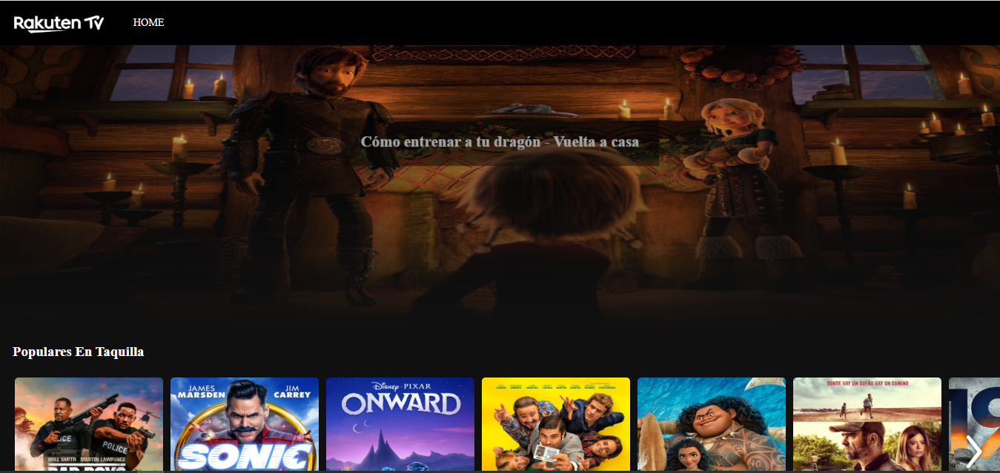

## How to get and run the project

<ul>
    <li>Clone the project</li>
    <li>Inside the main folder run the command <b>npm install</b></li>
    <li>Inside the folder <b>cors-anywhere</b> run the command <b>npm install</b></li>
    <li>Inside the folder <b>cors-anywhere</b> run the command <b>nodemon server.js</b></li>
    <li>In the main folder run the command <b>npm start</b></li>
    <li><a href="http://localhost:8080/" target="_blank">http://localhost:8080/</a></li>
</ul>

If everything is set well you will see something like the picture bellow.

Unfortunatelly the trailer endpoint it doesn't work so I couldn't make a component in order to paly the trailer of each movie.
